## Part 1
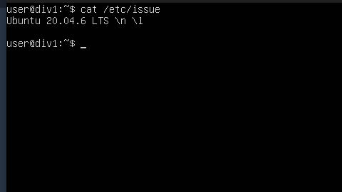
## Part 2
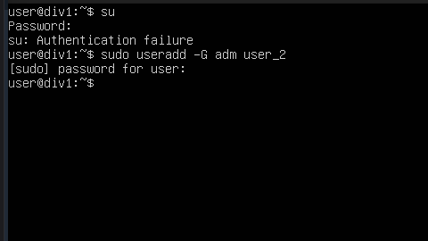 
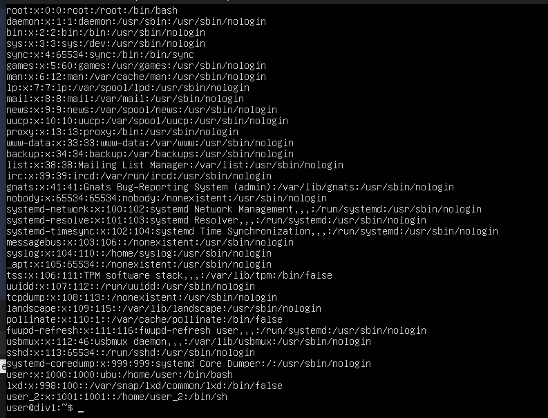

## change the machine name 
- sudo hostnamectl set-hostname user-1

## set the time zone 
- timedatectl set-timezone Europe/Moscow

## Output the names of the network interfaces using a console command.
## install NetworkManager and start and enable it
- nmcli device status

## we can also check our interface and ip address with the next command
- ip a s

## command to get the ip address of the device you are working on from the DHCP server.
- nmcli device show enp0s3

## to change our ip address from dynamic to static I modified the next file: /etc/netplan/00-installer-config.yaml with the next command.

- sudo nano netplan/00-installer-config.yaml

## then I chanage the option for dhcp4 from true to no. then I added the next lines: 
-      addresses:
-        - 10.0.2.100/24
-      gateway4: 10.0.2.2
-      nameservers:
-        addresses: [8.8.8.8, 1.1.1.1]
 
## then I reboot the system with the next command
- reboot

## Part 4
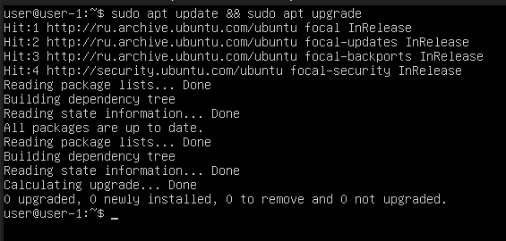 

## Part 5: the about sudo command, it a powerful command by default to have root access temporarly and we can say; sudo means "super user do" but also we can use it to run commands using another users.
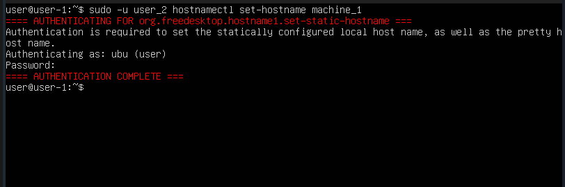 

## Part 6:
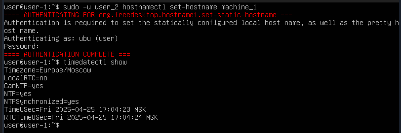 

##Part 7: to start write we need to press i. to exit from vim after modife the content, should press key Esc and then write :wq and that's mean write and quit.

## to edit and save changes in nano we can use ctrl + o to save and ctrl + x to exit
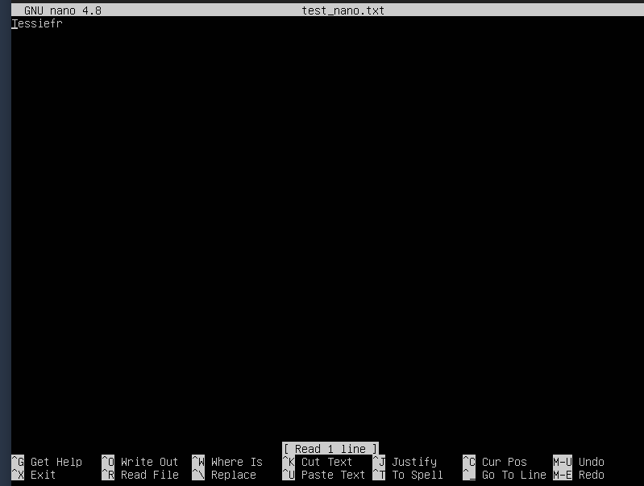 
## in emacs to save Ctrl+X Ctrl+S and to exit Ctrl+X Ctrl+C.
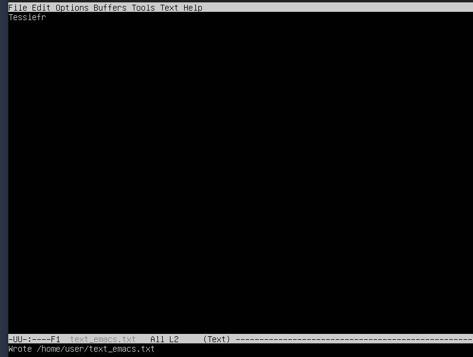

## to exit without save any changes we can write :q!
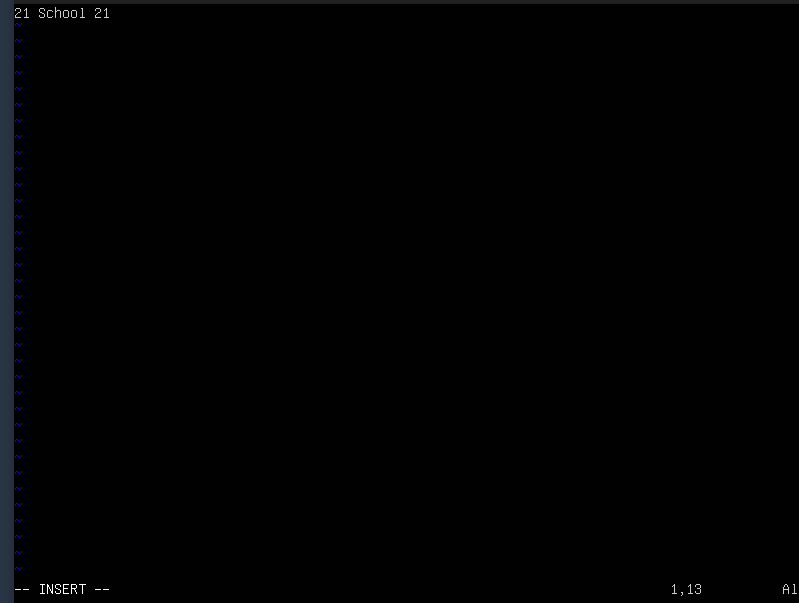
## in nano to exit without save anything we can just press ctrl + x and then n.
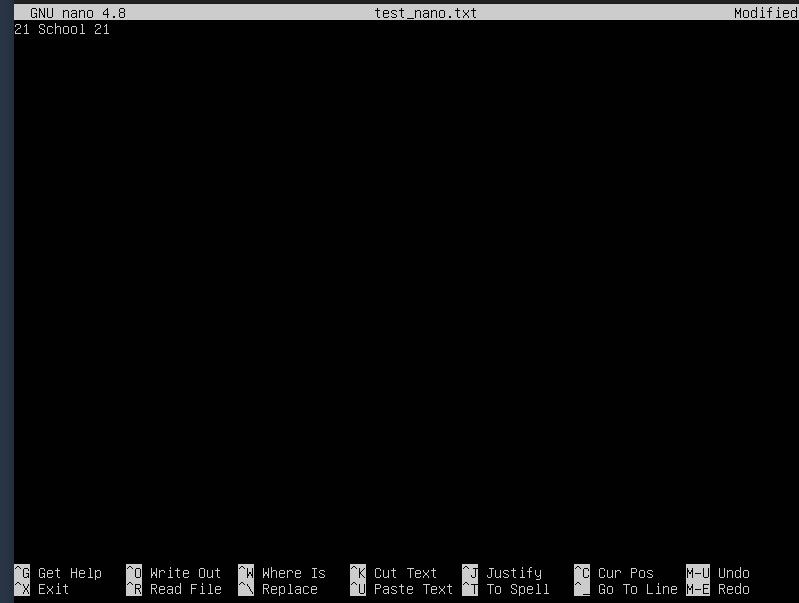
## in emacs we can use the same shortcut to exit and then press n then write yes.
 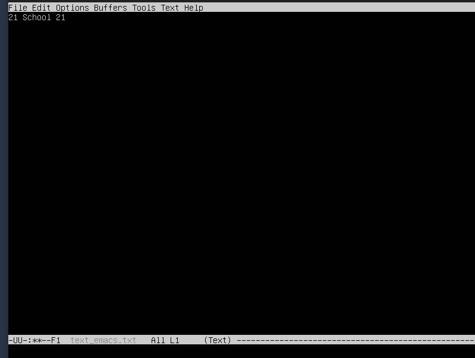

## in vim to search we can press / then write what we want to search and to find and replace we can write :s/ then the word / then what we want to replace it with.

## in nano we can search using ctrl + w and to replace we can use the next shortcut ctrl + \ .
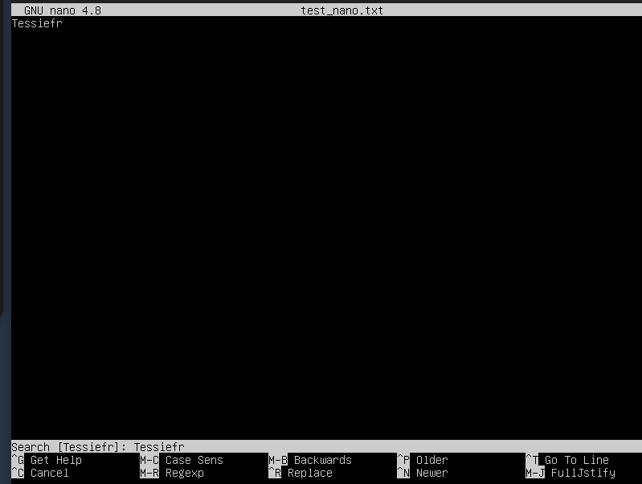 
## emacs to search we can use this shortcut Ctrl+S and to find and replace we can use ALT+SHIFT+5 then enter the word we want to replace it and then what we want to replace it with.
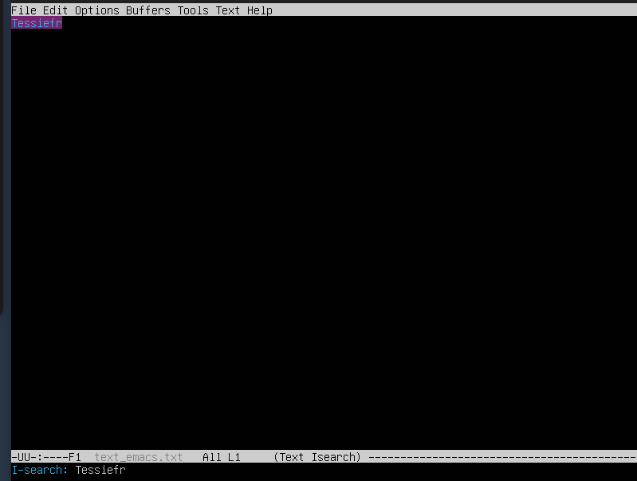

## Part 8 to install sshd we need to use the next command 
- sudo apt install ssh
## then to make it run when we boot the system
- sudo systemctl enable ssh
## to change the port we need to uncomment line "port 22" and the change the port number to 2022
- sudo nano /etc/ssh/sshd_config
## then 
- sudo systemctl restart sshd

## to show the ssh is running we can use command ps with the next options and then pipe it to grep 
##    ps aux:
##        a – Shows processes for all users.
##        u – Displays user-oriented format (shows user, CPU, memory usage, etc.).
##        x – Includes processes not attached to a terminal (like daemons, including sshd).
##    | grep sshd – Filters the output to show only lines containing sshd.    
##command: 
- ps aux | grep sshd
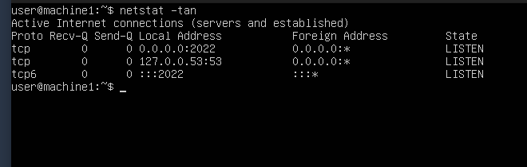

## -tan option with command netstat means t:tcp a:all n:numeric

## Part 9 uptime: 00:21:03, authorised users: 1, average load: 0.00,  pid highest memory usage: 1618, cpu time: 1782, 
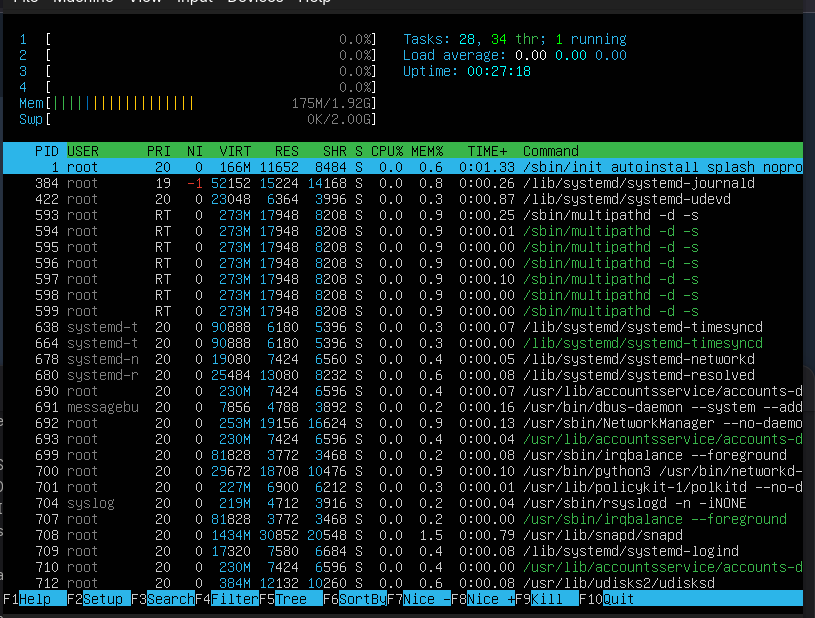 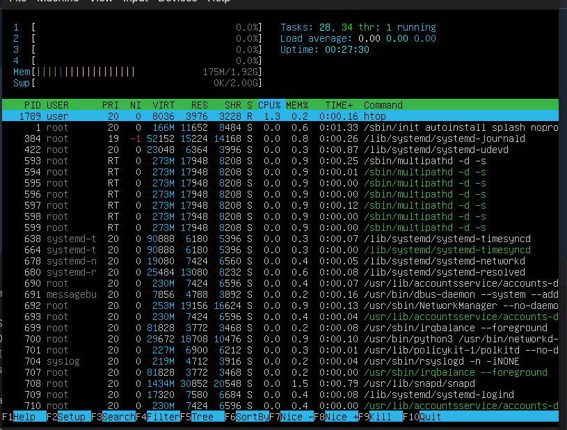 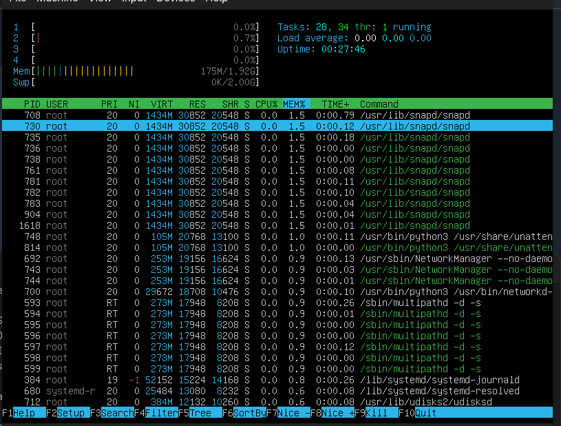 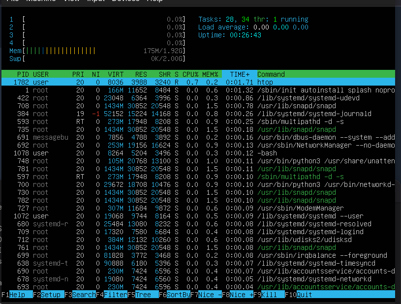
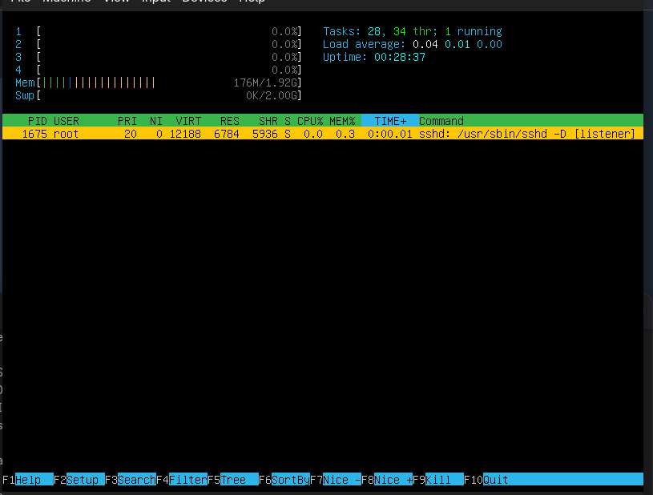 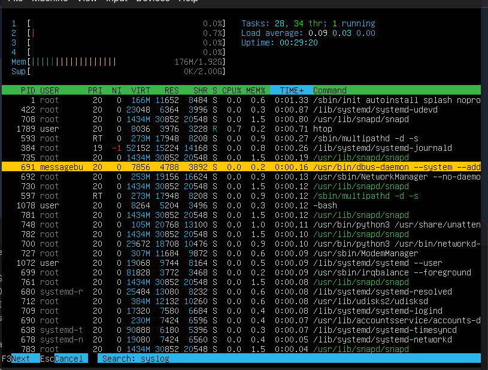 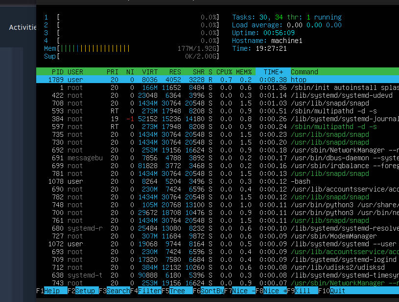

## Part 10 drive name is sda, size 25Gib, number of sectors 52428800, swap size is 2Gib

## Part 11 root partition
- size = 11758760
- space used 5262172 
- free = 5877480
- percentage used 48% .
## with option -Th 
- size = 12G
- space used = 5.1G
- space free = 5.7G
- percentage used = 48%
## file system is ext4

## Part 12 
-  size of /home = 96k
- /var/log = 94m
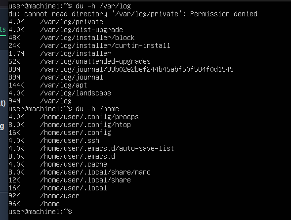

## Part 13
- size of /home = 92.0 Kib
- /var/loh = 96Mib
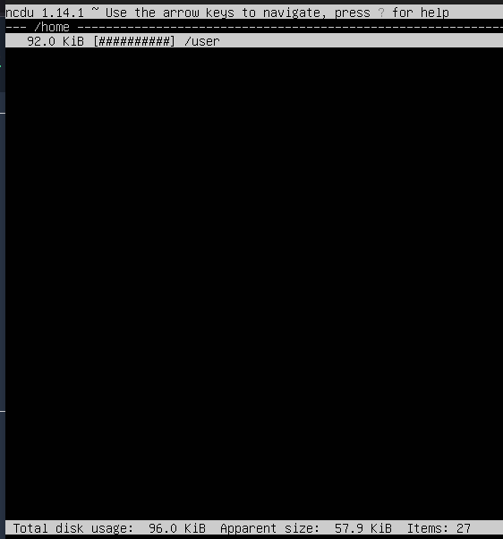 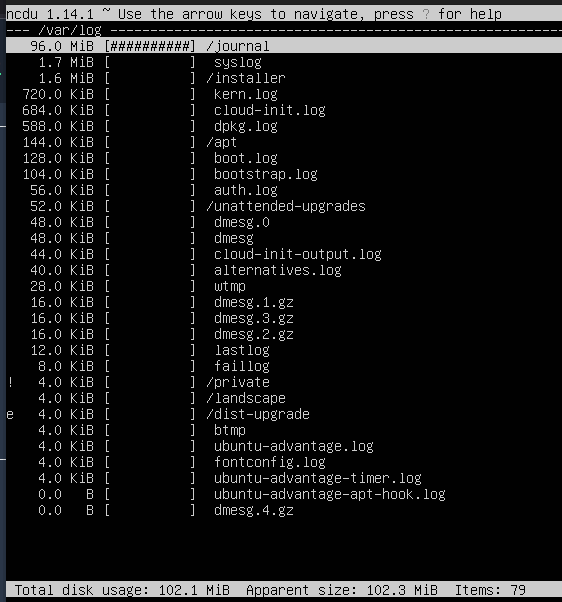

## Part 14
- last login: 26.04.2025 10:00:13 user tty1
- I used command sudo grep -a "Accepted" /var/log/auth.log | tail -1
## then to restart sshd we can use the next command
- sudo systemctl restart sshd
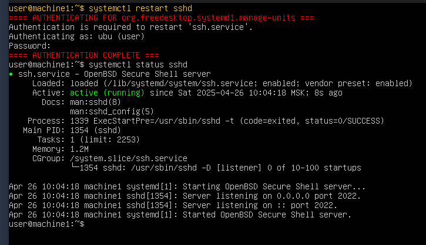

## Part 15 to list jobs we can use the next command
- crontab -l
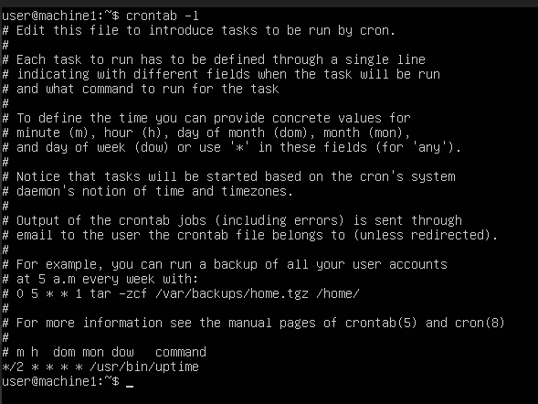
## then to add a new job like using uptime every two min:
- crontab -e
## and we can add the next line:
- */2 * * * * /usr/bin/uptime
## to check the log file 
- sudo grep CRON /var/log/syslog | grep uptime
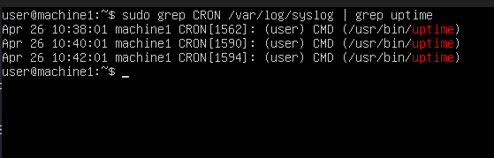
## to remove all jobs
- crontab -r
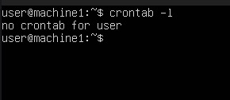
